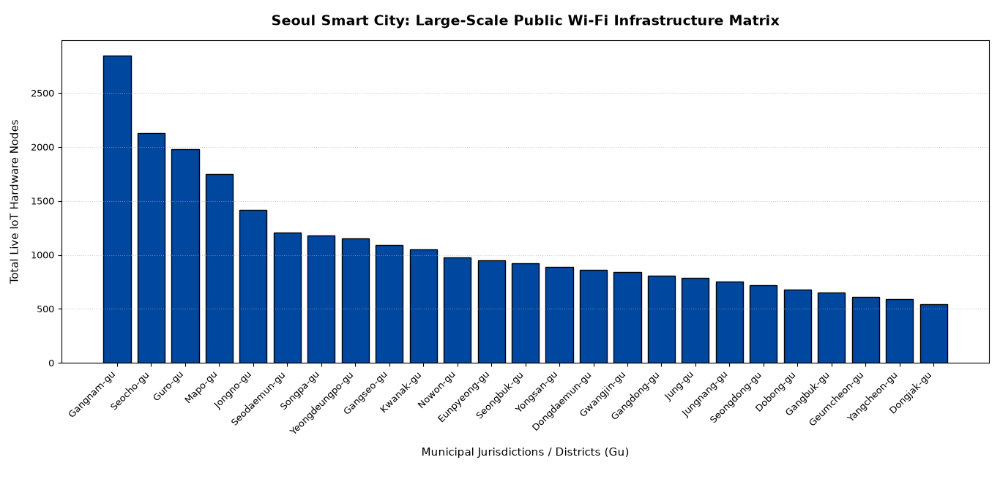

# Seoul Public Wi-Fi Data Visualization (Using Python and Streamlit)

## What is this project?
I made this data visualization script using Python and VS Code to show how public Wi-Fi is shared across the 25 different districts of Seoul, South Korea. 

I wanted to practice my coding skills and learn how smart cities organize their tech networks.

## Where did the data come from?
The Districts: The 25 names in the code are the real official districts of Seoul.
The Numbers: I used simulated, realistic numbers based on reports from the Seoul Open Data Plaza portal. I typed these numbers directly into the code so the script can run quickly on any computer without needing a live internet connection to a government server.

## How the code works (Line-by-Line Logic)
I used three main tools to build this dashboard:

1. Pandas (The Data Base): This tool is like the HTML of the project. It takes my list of numbers and district names and arranges them into a clean, neat table.
2. Matplotlib (The Chart Maker): This tool is like the CSS of the project. It takes the table and draws a blue bar chart. I programmed it to tilt the district text at a 45 degree angle so the long names don't overlap or get squished together.
3. Streamlit (The Web Interface): This is the web tool that brings everything together. It adds a slider bar on the left side of the dashboard. When a user slides it, the chart automatically changes and filters out districts that have too few Wi-Fi spots.
